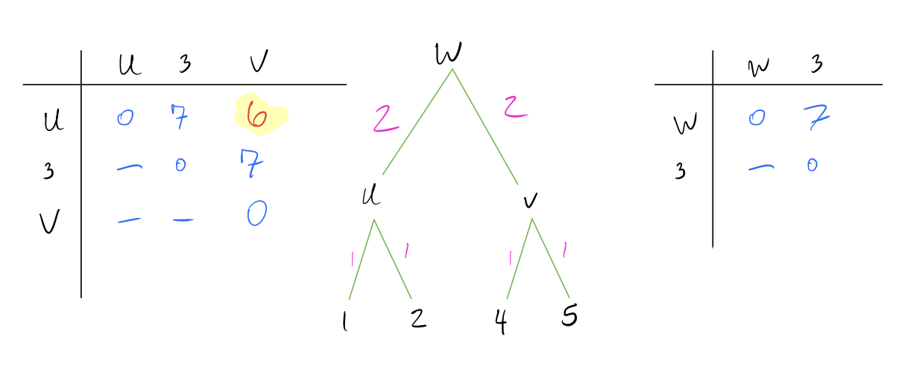
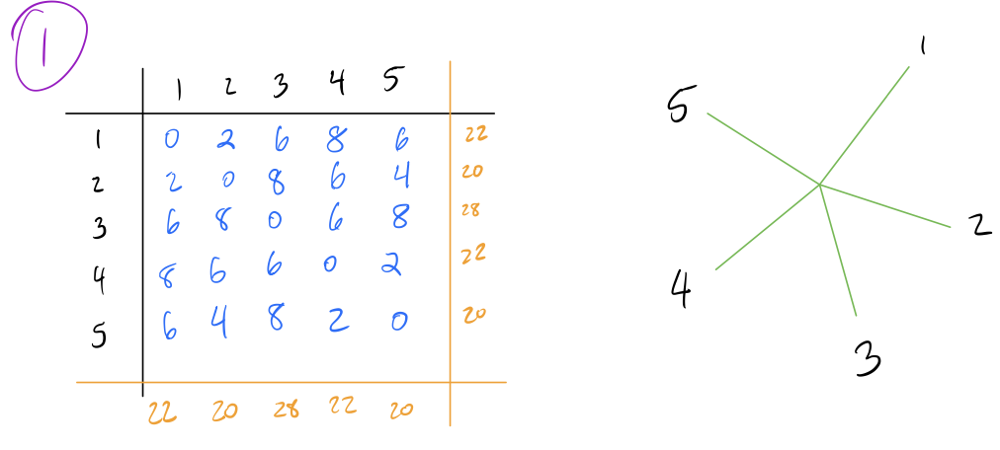

```{r setup, include=TRUE, warning=FALSE, message=FALSE}
# Package imports
library(ape)
library(DECIPHER)

# Helper plotting function
plot_tree_unrooted <- function(dend, title){
  tf <- tempfile()
  WriteDendrogram(dend, file=tf, quoteLabels=FALSE)
  predTree <- read.tree(tf)
  plot(predTree, 'unrooted', main=title)
}
```

## Distance Matrices

Most phylogenetic reconstruction algorithms rely upon constructing
distance matrices. There are a variety of way to do this, but for
purposes of illustration we'll be using the simplest method.

Let's construct a toy dataset for purposes of illustration:

```{r}
sequenceSet <- DNAStringSet(c('AGACT',
                              'AGACG',
                              'TCATT',
                              'TGCTG',
                              'AGCTG'))
names(sequenceSet) <- 1:5
```


For each pair of sequences, we count the proportion of residues that do not match and mark this as the distance between them. As an example of calculating distance, consider the first two sequences in this set:

\begin{align*}
&1)\;\;&AGACT&\\
&2)\;\;&AGACG&
\end{align*}

Since these sequences differ at 1 out of 5 total residues, their distance is $\frac{1}{5}=0.2$.

We can quickly calculate a complete distance matrix between these sequences with the following:

```{r}
dm <- DistanceMatrix(sequenceSet, type='dist', verbose=F)
dm
```

Notice that the distance between 1 and 2 is 0.2, just as we calculated
before. Now we can begin to create trees.

***

## UPGMA/WPGMA

The simplest tree building method is the Unweighted Pair Group Method
with Arithmetic Means (UPGMA). This is a hierarchical clustering
algorithm that sequentially builds a tree from the bottom up. The
algorithm begins with a distance matrix, and proceeds in the following
steps:

1.  Identify the pair of nodes with the lowest distance $d_{min}$. Here
    I've multiplied the distances by 10 to make it easier to read (it
    doesn't make a difference in the final result).

2.  Create a new node $N_{new}$ that joins these pairs of nodes, and
    create branch lengths such that each leaf is equidistant from
    $N_{new}$ The total branch length should from the $N_{new}$ to any
    leaf should be half of $d_{min}$. In this case, $d_{min} = 2$ and
    our new node is called $u$.

3.  Combine the two rows of the distance matrix into one row by
    replacing each pair of entries with their average. The average is
    weighted by the number of leaves in each pair being combined, so if
    the two rows are each clusters with multiple leaves, the average
    should be weighted accordingly.


4.  Repeat above steps until all nodes are combined and the distance
    matrix is a single row and column.





Note that UPGMA methods always create an ultrametric tree, which means the tree is rooted and all leaves are equidistant from the root. This implies a molecular clock (rate of mutation is the same across all lineages of a tree).

We can create a UPGMA tree in R with the below commands. Note that R doubles the lengths obtained by this, so I'm going to multiply the distance matrix by 5 to get the same scale factor as the example worked through above.

```{r}
# UPGMA Tree
dend <- as.dendrogram(hclust(dm*5, method='average'))
plot(dend)
```

A variation of UPGMA is WPGMA, where W stands for 'weighted'. The difference 
between UPGMA and WPGMA is a bit counter-intuitive. Recall that when we combine 
two rows of the distance matrix in UPGMA, we weight our average by the number of 
leaves in the node being combined. In WPGMA, we do **not** weight by 
number of leaves in the node, and instead treat each node as having equal weight.

As an example, consider the following distance matrix:

$$ \begin{matrix} 
    & n_1 & n_2 & n_3 \\
n_1 & 0   & 3   & 5  \\
n_2 & -   & 0   & 3  \\
n_3 & -   & -   & 0  \\
\end{matrix}$$

Now suppose that node $n_1$ has 10 leaves, node $n_2$ has 2 leaves, and node $n_3$ has 1 leaf.
If we wanted to combine nodes $n_1$ and $n_2$ into node $u$ using UPGMA, the 
distance from $u$ to $n_3$ would be calculated with the following formula:

\begin{align*}
d_{UPGMA}(u, n_3) &= \frac{1}{|n_1| + |n_2|} \left(|n_1|*d(n_1,n_3) + |n_2|*d(n_2,n_3) \right)\\ 
&= \frac{1}{10+2} \left(10*5 + 2*3 \right) \\
&= 4.67
\end{align*} 

However, if we combined these with WPGMA, we would instead ignore the number of 
leaves in each cluster and just take the simple arithmetic average, as follows:

\begin{align*}
d_{WPGMA}(u, n_3) &= \frac{1}{2} \left(d(n_1,n_3) + d(n_2,n_3) \right)\\ 
&= \frac{1}{2} \left(5 + 3 \right) \\
&= 4
\end{align*} 

You're probably wondering, "why does *weighted* PGMA use *unweighted* combinations
and vice-versa?" The answer lies in what we're referring to when we talk about 
pair combinations being (un)weighted. Since UPGMA weights each node by the number 
of leaves, it's correcting for nodes representing clades of difference sizes. 
In other words, the combination is inherently weighted, and UPGMA uses a clever
way to "undo" this combination. WPGMA, by contrast, does not weight by clade 
size, and thus the combinations are biased (weighted) by the number of leaves 
in each nodes. 

Implementing WPGMA trees is very similar to UPGMA trees (and gives the same 
result in this example):

```{r}
# WPGMA Tree
dend <- as.dendrogram(hclust(dm*5, method='mcquitty'))
plot(dend)
```

There are also other methods for combining the distance matrices--see the help
page for `hclust` for other examples.

---------------------

## Neighbor Joining Trees

Another common approach to building trees is the Neighbor-Joining (NJ)
method. This method also utilizes distance matrices, but proceeds from
the top-down rather than UPGMA's bottom-up approach. We'll use the same
distance matrix (multiplied by 10 as before for simpler visualization).
The algorithm proceeds in the following steps:

1.  Start with a star tree (all connected to a single root node), and
    record the row and column sums for each row/column of the matrix.



2.  Create a Q-matrix, which is a matrix of the same dimensions as the
    distance matrix, and each element given by the following formula:

$$Q[i,j] = (n-2)d(i,j) - R(i) - C(j)$$

|       Here $n$ is the number of nodes under consideration (the number of 
|       rows of the distance matrix), $d(i,j)$ is the distance from node $i$ 
|       to node $j$, $R(i)$ is the sum of the $i$'th row, and $C(j)$ is the sum
|       of the $j$'th column.

3.  Identify the smallest pair $f,g$ in the Q-matrix, and combine the
    corresponding nodes by adding an intermediate node $N_{int}$ between
    them in the tree.


4.  Calculate edge lengths from $N_{int}$ to $f,g$ with the following
    formula:

\begin{align*}
d(N_{int}, f) &= \frac{1}{2}(d[i,j]) + \frac{1}{2(n-2)}(R(i) - C(j))\\
d(N_{int}, g) &= d[i,j] - d[N_{int}, f]
\end{align*}

|       In this case, we have $d[1,2] = 2$, $R(1) = 22$, $C(2) = 20$. Thus, for our new node $u$, we have:

```{=tex}
\begin{align*}
d[u,1] &= \frac{1}{2}(2) + \frac{1}{2(3)}(20-22) &= \frac{2}{3} \\
d[u,2] &= 2 - \frac{2}{3} &= \frac{4}{3}
\end{align*}
```
5.  Calculate distance from $N_{int}$ to all other nodes $h$ with the
    following formula:

$$d(h, N_{int}) = \frac{1}{2}(d[h,g] + d[h,f] - d[f,g])$$

6.  Repeat until the full tree has been constructed.


|  Once we only have three nodes left, we just need to figure out the
branch lengths.

|  We can do this in the exact same way as before.


***

This can be done in R with the following commands. Note that the output is
slightly different due to a different method for calculating the initial distance matrix.

```{r, results='hide'}
dend <- TreeLine(myDistMatrix=dm, method='NJ')
plot_tree_unrooted(dend, 'NJ')
```

***

## Maximum Parsimony Trees

The last way to construct phylogenies that I will discuss is maximum parsimony.
This method relies on the assumption that the simplest method is likely the best, and thus tries to find a tree that minimizes the number of changes on the tree. Such a tree is called the most "parsimonious" tree.

To illustrate what this looks like, we'll look at a subset of our initial set of sequences. I've also included a distance matrix corresponding to the number
of state transitions required to switch from one sequence to another (the Hamming distance).


Notice how sequences 1 and 2 are very similar, and sequences 4 and 5 are very
similar. An optimal reconstruction would place sequences 1 and 2 close together and sequences 4 and 5 close together, since these pairs require the fewer transitions to convert between. For a set of 4 nodes, we have four possible
topologies:


Three of these are trees with a single internal branch, and one is a star tree
with no branches. The top left tree is the most parsimonious, because it minimizes the transition cost along any particular path of the tree.

Parsimony tree reconstructions don't use distance matrices, and instead randomly walk through tree space to find a tree that is most parsimonious. A purely random strategy would take eons to complete, so modern methods use various optimizations. Common techniques include iteratively adding branches to maximize parsimony with each branch added, and/or perturb trees by performing nearest neighbor interchanges (NNIs). NNIs take a quartet in the tree and swap the partition to check if a rearrangement is more parsimonious. An example of an NNI would be taking any of the quartets in the previous graphic and checking if any of the other types are more parsimonious.

We can do maximum parsimony reconstructions in R using the following code:

```{r, results='hide'}
dend <- TreeLine(sequenceSet, method='MP')
plot_tree_unrooted(dend, 'MP')
```
