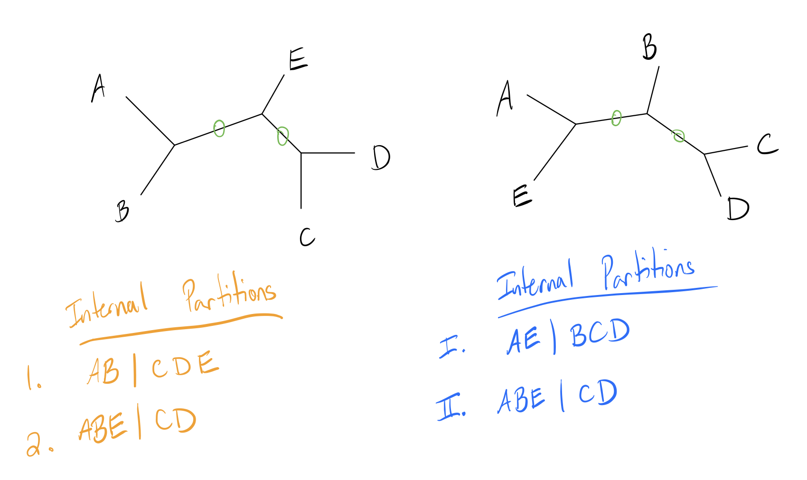

```{r setup, include=FALSE}
knitr::opts_chunk$set(
  fig.path = "man/figures/"
)
```

Making trees is nice, but how do we compare them? Comparing trees is a difficult problem, since they can contain significantly different topologies.

In this discussion I'll cover two common ways of calculating distances between trees: Robinson-Foulds (RF) Distance and Kuhner-Felsenstein (KF) distance.

```{r warning=FALSE, message=FALSE}
# Package imports
library(ape)
library(DECIPHER)
source('data/TreeLine.R')

# Helper plotting function
plot_tree_unrooted <- function(dend, title){
  tf <- tempfile()
  WriteDendrogram(dend, file=tf, quoteLabels=FALSE)
  predTree <- read.tree(tf)
  plot(predTree, 'unrooted', main=title)
}
```

## &nbsp; {.tabset .tabset-fade .tabset-pills}

***

### Setup

We'll start with a slightly larger test dataset so that we can more clearly see differences between tree constructions. The following codeblocks read in a set of 25 simulated alignments, then constructs phylogenetic trees using the three methods discussed previously.

```{r, results='hide'}
# External data file, contains simulated alignment
simSeqsFile <- 'data/Simulated_v1.fas'

simAli <- suppressWarnings(readDNAStringSet(simSeqsFile))[1:25]
names(simAli) <- 1:25
simDm <- DistanceMatrix(simAli, type='dist', penalizeGapGapMatches=FALSE, verbose=FALSE)

UPGMAtree <- as.dendrogram(hclust(simDm, method='average'))
NJtree <- TreeLine(simAli, myDistMatrix=simDm, method='NJ')
MPtree <- TreeLine(simAli, myDistMatrix=simDm, method='MP')
```


Visualizing the trees we've made:

```{r}
plot_tree_unrooted(UPGMAtree, 'UPGMA')
plot_tree_unrooted(NJtree, 'NJ')
plot_tree_unrooted(MPtree, 'MP')
```

### Partitions

Before we dive into tree distances, it's important to understand the concept of
partitions. In a bifurcating unrooted tree, every edge divides the set of leaf nodes into two sets. These form the basis of many tree comparison algorithms. Let's look at a toy example:


Note how each numbered edge of the tree splits the labeled leaf nodes into two distinct groups to either side of it. Leaf edges trivially split the tree into a partition of just the leaf and everything else, but internal edges split the leaves into more interesting partitions.

### RF Distance

Robinson-Foulds (RF) distance measures the similarity of these partitions in a tree. Let's look at a toy example with two small trees and their internal partitions labeled (internal edges circled in green):



Now let $A$ be the number of partitions unique to the first tree, and $B$ the number of partitions unique to the second tree. The RF distance (also called the symmetric difference metric) is simply the quantity $(A+B)$.

For this example, note that edge 2 is an identical partition to edge II. Thus, the first tree has one unique partition, and the second tree has one unique partition, so the RF distance is $1+1=2$. 

Some implementations change the metric slightly by scaling it, either by dividing by two or scaling the metric to have a maximum value of 1. The latter operation can be done by dividing by the maximum possible score, which is just the sum of the total number of branches. In this case, the total number of internal branches is 4 (2 from each tree), so the RF distance is $0.5$.

#### R implementation
```{r, warning=FALSE}
RF_dist_external <- function(dend1, dend2){
  tf <- tempfile()
  WriteDendrogram(dend1, file=tf, quoteLabels=FALSE)
  predTree1 <- read.tree(tf)
  
  tf <- tempfile()
  WriteDendrogram(dend2, file=tf, quoteLabels=FALSE)
  predTree2 <- read.tree(tf)
  
  return(dist.topo(predTree1, predTree2, 'PH85'))
}

RF_dist_external(UPGMAtree, NJtree)
RF_dist_external(UPGMAtree, MPtree)
RF_dist_external(NJtree, MPtree)
```

#### Drawbacks

RF distance is widely used, but has some common issues that should be kept in mind while using it:

- Lacks sensitivity
  - Similar trees can receive the same value
  - Range of values depends on tree shape
  - Doesn't look at branch length
- Can't recognize similar clades (any difference increases distance score)
- Original implementation assumes bifurcating, unrooted tree with same leaf set
- Distance is not immediately statistically interpretable (larger $\neq$ significant)

Some of these drawbacks have been accounted for with subsequent optimization, and 'generalized RF distances' have been created that can account for similar sets while working on multifurcating trees with different leaf sets.

***

### KF Distance

The Kuhner-Felsenstein (KF) distance attempts to incorporate branch lengths into the RF distance to gain a richer description of the differences between two trees. 

Recall that the RF distance is the number of unique (non-shared) partitions in the tree. The KF distance is instead taken as the sum of the squared difference of branch lengths for each equivalent partition in the two trees. If a partition is a unique to a particular tree, it is taken as having a branch length of 0 in the other tree. Below is an updated version of our previous example with branch lengths added in pink (partitions labeled):


Here we will also examine the leaf branches, but since the leaf set is the same and branch lengths are identical, all of these branches cancel each other out. One pair of branches is an equivalent partition (2 and II), and the other two are unique. The KF distance is then:

\begin{align*}
KF(Tr1, Tr2) &= (len(1) - 0)^2 + (0 - len(I))^2 + (len(2) - len(II))^2 \\
&= (2-0)^2 + (0-6)^2 + (2-3)^2 \\
&= 41
\end{align*}

The advantages of this over RF distance is that it can incorporate branch lengths in addition to topology, which allows it to downweight small differences in topology and upweight large differences.

#### R Implementation
```{r, warning=FALSE}
KF_dist_external <- function(dend1, dend2){
  tf <- tempfile()
  WriteDendrogram(dend1, file=tf, quoteLabels=FALSE)
  predTree1 <- read.tree(tf)
  
  tf <- tempfile()
  WriteDendrogram(dend2, file=tf, quoteLabels=FALSE)
  predTree2 <- read.tree(tf)
  
  return(dist.topo(predTree1, predTree2, method='score'))
}

RF_dist_external(UPGMAtree, NJtree)
RF_dist_external(UPGMAtree, MPtree)
RF_dist_external(NJtree, MPtree)
```

***

### Manual Implementations

I wrote implementations of both distances from scratch to illustrate how these functions are working under the hood. Note that external packages incorporate some optimizations I didn't implement that lead to different results.

#### Helper functions

This code block contains several helper functions and is compressed by default. Click "Code" to show this content.

```{r class.source= 'fold-hide'}
flatdendrapply <- function(dend, NODEFUN, LEAFFUN=NODEFUN, INCLUDEROOT=TRUE, ...){
  ## Applies a function to each node (internal and leaf) of the tree
  ## Returns a flat list
  val <- lapply(dend, 
                \(x){
                  if (is.null(attr(x, 'leaf'))){
                    v <- list(NODEFUN(x, ...))
                    for ( child in x ) v <- c(v, Recall(child))
                    return(v)
                  } 
                  else if (!is(LEAFFUN, 'function'))
                    return(list())
                  else 
                    return(list(LEAFFUN(x, ...)))
                }
  )
  retval <- unlist(val, recursive=FALSE)
  if (!INCLUDEROOT)
    retval[[1]] <- NULL

  return(retval)
}

isLeaf <- function(dendNode){
  return(!is.null(attr(dendNode, 'leaf')) && attr(dendNode, 'leaf'))
}

equivPart <- function(set1, set2, fullset){
  # Checks if two partitions are equivalent
  inverseset1 <- fullset[!(fullset %in% set1)]
  return(setequal(set1,set2) || setequal(inverseset1, set2))
}

get_branch_length <- function(dendNode){
  ## Helper function for KF distance, gets partition and branch length
  ## of all branches Because of weirdness each node will return two values,
  ## the result just needs some slight post-processing 
  ## (see KF_Distance function for example)
  if(isLeaf(dendNode)){
    return(0)
  }
  
  h <- attr(dendNode, 'height')
  n1 <- dendNode[[1]]
  n2 <- dendNode[[2]]
  c1 <- attr(n1, 'height')
  c2 <- attr(n2, 'height')
  
  if(isLeaf(n1))
    labs1 <- attr(n1, 'label')
  else 
    labs1 <- unlist(n1)
  
  if (isLeaf(n2))
    labs2 <- attr(n2, 'label')
  else
    labs2 <- unlist(n2)

  l1 <- list(length=h-c1, part=labs1)
  l2 <- list(length=h-c2, part=labs2)
  return(list(l1, l2))
}
```

#### Robinson-Foulds Distance

```{r}
RF_Distance <- function(dend1, dend2){
  # Get all partitions
  part1 <- flatdendrapply(dend1, unlist, NULL)
  part2 <- flatdendrapply(dend2, unlist, NULL)
  allmembers <- unique(c(unlist(dend1), unlist(dend2)))
  
  # Calculate tree distance
  A <- B <- 0
  for ( i in seq_along(part1))
    A <- A + !any(sapply(part2, \(x) equivPart(part1[[i]], x, allmembers)))
  
  for ( i in seq_along(part2))
    B <- B + !any(sapply(part1, \(x) equivPart(part2[[i]], x, allmembers)))
  
  # This implementation normalizes to get a distance out of 1
  return((A+B) / (length(part1) + length(part2)))
}
```

#### Kuhner-Felsenstein Distance

```{r}
KF_Distance <- function(dend1, dend2){
  # Get all branch lengths and partitions
  part1 <- flatdendrapply(dend1, get_branch_length, NULL)
  part2 <- flatdendrapply(dend2, get_branch_length, NULL)
  
  # Each function call returns a length of list two, we just want the members
  part1 <- unlist(part1, recursive=FALSE)
  part2 <- unlist(part2, recursive=FALSE)
  
  # Root is split into two branches, need to combine
  part1[[1]]$length <- part1[[1]]$length + part1[[2]]$length
  part2[[1]]$length <- part2[[1]]$length + part2[[2]]$length
  part1[[2]] <- part2[[2]] <- NULL
  
  allmembers <- unique(c(unlist(dend1), unlist(dend2)))
  
  # For each
  treedist <- 0
  for ( i in seq_along(part1)){
    check <- sapply(part2, \(x) equivPart(part1[[i]]$part, x$part, allmembers))
    if (any(check)){
      loc <- which(check)
      treedist <- treedist + (part1[[i]]$length - part2[[loc]]$length)**2
    }
  }
  for ( i in seq_along(part2)){
    check <- sapply(part1, \(x) equivPart(part2[[i]]$part, x$part, allmembers))
    if (any(check)){
      loc <- which(check)
      treedist <- treedist + (part2[[i]]$length - part1[[loc]]$length)**2
    }
  }
  
  ## divided by two since duplicates will be added twice
  ## probably worth reworking at some point to avoid adding duplicates twice,
  ## this is just a quick fix
  return(sqrt(treedist/2))
}
```

```{r}
RFDists <- KFDists <- matrix(0, nrow=3, ncol=3)
rownames(RFDists) <- rownames(KFDists) <- colnames(RFDists) <- colnames(KFDists) <- c('UPGMA', 'NJ', 'MP')

RFDists[1,2] <- RFDists[2,1] <- RF_Distance(UPGMAtree, NJtree)
RFDists[1,3] <- RFDists[3,1] <- RF_Distance(UPGMAtree, MPtree)
RFDists[2,3] <- RFDists[3,2] <- RF_Distance(NJtree, MPtree)
KFDists[1,2] <- KFDists[2,1] <- KF_Distance(UPGMAtree, NJtree)
KFDists[1,3] <- KFDists[3,1] <- KF_Distance(UPGMAtree, MPtree)
KFDists[2,3] <- KFDists[3,2] <- KF_Distance(NJtree, MPtree)

RFDists
KFDists
```

***

### Other Metrics

These are two commonly used metrics, but many more are implemented in the `TreeDist` package. Notable recent tree distance measures include:

- `TreeDist::TreeDistance` methods, using generalized RF distance from Smith (2020)
- `TreeDist::JaccardRobinsonFoulds` and `TreeDist:NyeSimilarity`, both generalized RF distances.
- `TreeDist::KendallColijn`, a distance that measures difference in path lengths between pairs of leaves
- `TreeDist::MASTSize`, a distance that measures the largest agreement subtree between two trees