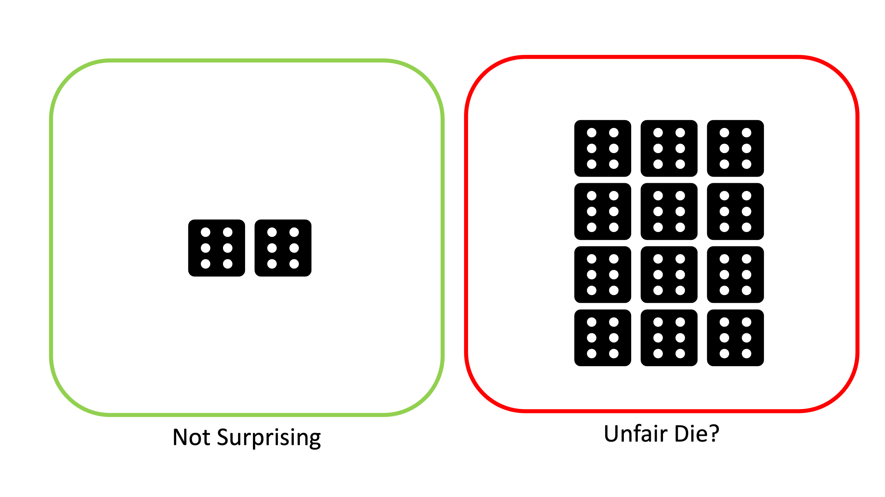

```{r setup, include=TRUE, warning=FALSE, message=FALSE}
options(rmarkdown.html_vignette.check_title = FALSE)
```
Statistical tests typically follow the same formula: we have a null hypothesis $H_0$ and an alternative hypothesis $H_A$, and then we do some math and determine a p-value $p$. Here $p$ represents the probability of obtaining results at least as the ones observed assuming the null hypothesis is true. In other words, how likely are we to observe a result this extreme purely due to chance? If $p < \alpha$ for some significance level $\alpha$ (typically 0.05), then we reject $H_0$ in favor of $H_A$. For example, if we roll a dice and get two sixes in a row, that would be surprising, but not *that* surprising. However, if we got 25 sixes in a row, we'd start to question if the die is actually fair.



If we start making multiple tests, however, the problem becomes more complicated. Single statistical tests measure the probability we would have observed a result due to chance--as we run increasingly more statistical inferences, the *probability* that we observe an extreme result becomes the *proportion* of our results that are that extreme. At $\alpha=0.05$ significance, 5% of our tests will incorrectly reject the null hypotheses. 

[Wikipedia](https://en.wikipedia.org/wiki/Multiple_comparisons_problem#Definition) cites an example where we test whether a drug decreases any one of a number of disease symptoms. If we test a single symptom, rejecting the null is significant. However, as we increase the number of symptoms we check, the probability of observing a spurious correlation between drug and a random symptom increases. If we check 100 symptoms and all tests are independent, the probability of at least one incorrect rejection is over 99%. 

This begs the question--how can we protect against error introduced by multiple testing?

## Types of Error

Before we talk about correction procedures, we first need to talk about what "error" means. For single statistical tests, we're typically worried about Type I and Type II error. 

A Type I error is where we incorrectly reject the null hypothesis. This is when we observed a striking result due to chance, leading a false positive. In single statistical tests, the probability of a Type I error is the significance level (so for $\alpha=0.05$, it's 5%). 

Type II error is the inverse--we fail to reject the null hypothesis when we should have rejected. This is when a normally extreme process happens to produce a normal looking result by chance, leading to a false negative. In single statistical tests, the probability of a Type II error is called $\beta$. The **power** of a statistical test is given by $1-\beta$.

```{r}
#| echo: false

cols <- c("#004D40", "#D81B60", "#1E88E5")
x <- seq(-5, 5, by=0.01)
vals1 <- dnorm(x)
vals2 <- dnorm(x, 3)
plot(x, vals1, type='l', xlim=c(-2.5,5), ylab='', xlab='', col=cols[1], yaxt='n', xaxt='n')
lines(x, vals2, type='l', col=cols[2])
ip <- which(vals2 == vals1)[sum(vals2==vals1)]
cutoff <- 1.8
polygon(c(x[x>=cutoff], max(x), cutoff), c(vals1[x>=cutoff], 0, 0),
        col="#004D404F",border=NA)
polygon(c(cutoff, min(x), x[x<=cutoff]), c(0,0,vals2[x<=cutoff]),
        col="#D81B604F",border=NA)
lines(c(cutoff,cutoff), c(0,100), lty=2)
text(0, 0.05, substitute(paste(bold("Type II Error"))),cex=0.75, col=cols[2])
text(2.9, 0.05, substitute(paste(bold("Type I Error"))),cex=0.75, col=cols[1])
lines(c(2.2,2.9), c(0.01,0.043), col=cols[1], lwd=1.5)
lines(c(0,1.2), c(0.043, 0.01), col=cols[2], lwd=1.5)

text(0, 0.25, substitute(paste(bold("Null Hypothesis"))),cex=0.55, col=cols[1])
text(3, 0.25, substitute(paste(bold("Alternate Hypothesis"))),cex=0.55, col=cols[2])
```
 
When we move into multiple testing, we instead examine the Family-Wise Error Rate (**FWER**) and the False Discovery Rate (**FDR**). Multiple testing correction is often a trade-off between minimizing FWER and FDR.

FWER is the probability of making *at least one* Type I error within a group of tests. Suppose we have $n$ tests--if each individual test has a Type I error rate of $\alpha$ and all tests are independent, the FWER ($\bar \alpha$) is simply:
$$ \bar \alpha = 1 - (1-\alpha)^n$$ 

FDR is the expected proportion of Type I errors across all tests. Put in terms of true/false positives:

$$ FDR = \frac{FP}{FP+TP} $$
Corrections that minimize FDR result in higher statistical power at the cost of more Type I errors. Minimizing FWER does the opposite; fewer Type I errors, but lower statistical power.

## Minimizing FWER for Multiple Hypotheses

The first group of methods deal with minimizing FWER for a set of multiple hypotheses. The drug testing example from earlier is a perfect example. Another example would be testing if a set of SNPs have a significant association with a particular disease--each null hypothesis $H_i$ is that SNP $i$ is not significantly associated with the disease. 

### Bonferroni Correction

Bonferroni correction is one of the simplest ways to minimize FWER across multiple tests. The motivation for this method comes from [Boole's Inequality](https://en.wikipedia.org/wiki/Boole%27s_inequality), which implies the following result for $n$ *independent* tests:

$$\bar \alpha \leq n\alpha$$

By solving this equation for $\alpha$, we see that if we set $\alpha = \frac{\bar \alpha}{n}$, we can constrain the FWER to any value we'd like. For example, to ensure FWER of at most 0.1 across 100 tests, we simply test for significance at the $\alpha = \frac{0.01}{100} = 10^{-4}$ significance level. 

This method is very simple, but comes with some drawbacks. Most notably, the result depends on the fact that the individual tests are independent--if any test is dependent, the correction is more conservative than necessary. Bonferroni correction also has less statistical power than some alternatives, like Holm-Bonferrroni or Šidák correction.

### Šidák Correction
The Šidák correction is slightly less stringent than Bonferroni correction while still conserving a fixed FWER rate. For this procedure, we instead back solve the initial calculation of FWER:

\begin{align*}
\bar \alpha &= 1 - (1-\alpha)^n \\
\implies \alpha &= 1 - (1-\bar \alpha)^\frac{1}{n}
\end{align*}

For our previous example of 100 tests at desired FWER of 0.1, we'd test for significance at the $\alpha = 1-(1-0.1)^{0.01} = 0.00105$ level, which is slightly higher than Bonferroni's $0.001$ significance level. Note that this test also requires independence of the individual statistical tests.

### Holm-Bonferroni
Holm-Bonferroni is an improvement on Bonferroni correction that is uniformly more powerful, meaning that it is always as least as powerful as Bonferroni. This method employs a sorting of the p-values for a set of null hypotheses.

To do Holm-Bonferroni correction, we first sort p-values $p_1,\dots,p_n$ such that $p_i \leq p_{i+1} \;\forall i$. We also sort our null hypotheses correspondingly into $H_1,\dots,H_n$. Then, for each $p_k$, we test if $p_k < \frac{\bar \alpha}{n+1-k}$. If it is, we reject $H_k$ and continue on to $p_{k+1}$. If not, then we stop and cannot reject any further hypotheses.

Holm-Bonferroni notably does not require each statistical test to be independent; it functions correctly under any dependence structure of the p-values.

### Hochberg Step-Up

A subtly different test is the Hochberg step-up procedure, which is uniformly more powerful than Holm-Bonferroni but requires each test to be statistically independent or positively dependent. The procedure is the same as Holm-Bonferroni, but instead of iteratively testing p-values, we find the maximal $k$ such that $p_k < \frac{\bar \alpha}{n+1-k}$, then reject null hypotheses $H_1,\dots,H_k$.

## Minimizing FWER for One Hypothesis
These methods are slightly different in that they tests whether *groups* of p-values are statistically significant, rather than examining individual p-values and null hypotheses. Thus, these methods are ideal for situations where several statistical tests are conducted on the same overall null hypothesis. An example of this kind of problem is testing whether a new curriculum improves students' scores on standardized tests. Each statistical test looks at paired experiment and control classrooms, and investigates if the performance of the experimental group is significantly different than the control. The null hypotheses is the same for all groups, that the new curriculum does not significantly impact outcomes.

Most of these methods test whether *groups* of p-values are statistically significant, rather than examining individual scores. 

### Fisher's Method
Fisher's Method is one of the simplest methods for multiple testing correction in the single hypothesis case. The method calculates a test statistic as:

$$ \chi_{2n}^2 \sim -2\sum_{i=1}^n \log {p_i} $$
This formula follows from the fact that, under independent unbiased statistical tests, the distribution of p-values should be uniformly distributed on $[0,1]$. A negative log-transform of a uniformly distributed variable produces an exponential distribution, and scaling it by two yields a chi-squared distributions with two degrees of freedom. Summing $n$ chi-squared distributions with two degrees of freedom produces a chi-squared distribution with $2n$ degrees of freedom. From this statistic and distribution, it is simple to calculate an overall p-value for the set of statistical tests. 

Note that this calculation depends on the statistical tests being independent from each other. If the p-values have any dependence, Fisher's Method will produce a result that is anti-conservative, meaning that it will occasionally incorrectly reject the null hypothesis. Additionally, Fisher's Method will overstate evidence against the null hypothesis in cases where the null is correctly rejected.

### Brown's Method
Brown's Method improves on Fisher's Method for cases where p-values are not independent but the covariance structure of the data $X$ is known. In this case, we can replace the $\chi^2(n)$ distribution with a scaled chi-squared distribution $c\chi^2(n')$, where the new constants are calculated as:

\begin{align*}
c &= \frac{Var(X)}{2E[X]}\\&\\
n' &= \frac{2\left(E[X]\right)^2}{Var(X)}
\end{align*}

This is often the best approximation if the data are generated from a multivariate normal distribution with known covariance, but this is a fairly specific situation.

### Cauchy Combination Test
Instead of transforming the p-values to a $\chi^2$ distribution, a tangent transformation can transform the data to a distribution with a tail that is approximately a Cauchy distribution allowing for arbitrary dependence between the p-values. The test statistic is given by:

$$X = \sum_{i=1}^n \omega_i \tan\left[(0.5-p_i)\pi\right]$$
Here $\omega_i$ are weights that sum to one. Given a standard Cauchy random variable W, we should have 
$$\lim_{t\to\infty} \frac{P[X>t]}{P[W>t]} = 1$$
Thus, we can find a p-value for the tests together by comparing $X$ to the quantiles of a standard Cauchy distribution.

### Harmonic Mean P-Value
If p-values are not independent and the variance of the data is unknown, the harmonic mean p-value (HMP) is often the best solution. Given the p-values for our tests, the HMP is calculated as:

$$\dot p = \frac{\sum_{i=1}^n w_i}{\sum_{i=1}^nw_i/p_i}$$
Here $w_i$ are the weights for each p-value such the sum of weights adds to one. If all tests are equally weighted, then $w_i=1/n \;\forall i$.

The HMP is generally anti-conservative, but less so than Fisher's Method. The level of anti-conservativeness decreases with $\dot p$, so low values of HMP have less error. This is strong enough that HMP is directly interpretable at levels of $\dot p \leq 0.05$.

An asymptotically exact p-value can be calculated from the HMP [using a Landau distribution](https://en.wikipedia.org/wiki/Harmonic_mean_p-value#Asymptotically_exact_harmonic_mean_p-value_procedure).

Note also that a multilevel test can be designed to use HMP at subsets of the original tests while maintaining the FWER. Using HMP for any subset $S$ of the p-values rejecting at $\dot p \leq \alpha\sum_{i\in S} w_i$ will approximately control the FWER at level $\alpha$. This method can be used to find significant subsets of the overall group of tests.

The HMP has a number of really great properties:

* Robust to positive dependency between p-values
* Insensitive to number of tests
* Robust to distribution of weights
* Most influenced by smallest p-values
* If HMP is not significant, neither are the HMPs of any subsets of the tests
* Controls FWER with lower FDR (greater power) than Benjamini-Hochberg

## Minimizing FDS for Multiple Hypotheses
These methods try to minimize the False Discovery Rate, generally resulting in higher FWER but also higher statistical power. Note also that FDS-based measures scale with the data--they try to limit *proportion of overall false positives* rather than *probability of at least one false positive*. Thus, more tests at the same FDR will yield more false positives than more tests at the same FWER.

### Benjamini-Hochberg

This method bears resemblance to the Hochberg step-up procedure, and constrains the FDR to at most $\alpha$. Like in Hochberg, we first sort the p-values in ascending order. We then find the largest $k$ such that $p_k \leq \frac{k}{n}\alpha$. The corresponding null hypotheses $H_1,\dots,H_k$ are all rejected, while the remaining null hypotheses cannot be rejected. 

This procedure can be observed geometrically by first plotting $(k,p_k)$ for all p-values, then drawing the line $y=\frac{\alpha}{n}x$. All points below the line correspond to hypotheses that are rejected, and all points above fail to reject.

```{r}
#| echo: false

set.seed(123)
alph <- 0.10
np <- 25L
#y <- runif(np, 0, 0.1)
y <- rexp(np, 10)
x <- seq_len(np)
y <- sort(y, decreasing=FALSE)
divlin <- (alph/np) * x
cols <- c("#004D40", "#D81B60")
transition <- which(y <= divlin)
transition <- transition[length(transition)]
cols <- c(rep(cols[1], transition), rep(cols[2], np-transition))
plot(x,y,col=cols, type='p', pch=19, xlab="Index", ylab="p-value", xlim=c(0,25), ylim=c(0,0.2), cex=0.5,yaxs='i',xaxs='i')
lines(x, divlin, col="#1E88E5", type='l', lwd=1)

```
Here the green points are those that we can reject the null hypothesis for, and red are those we cannot.

Benjamini-Hochberg is valid when all tests are independent and for some cases of dependence, but isn't universally valid. If there is a concern of dependence between values, use Benjamini-Yekutieli or HMP instead.

### Benjamini-Yekutieli

Benjamini-Yekutieli improves on Benjamini-Hochberg by allowing for good performance under arbitrary dependence scenarios. The algorithm is the same, but modify our bound by checking for the largest $k$ such that $p_k \leq \frac{k}{c(n)* n}\alpha$. 

$c(n)$ is a new parameter that is defined as follows:

* If tests are independent or positively correlated, $c(n) = 1$.
* Otherwise, $c(n) = \sum_{i=1}^n n^{-1}$, the $n^{th}$ harmonic number.

For large values of $n$, $c(n) \approx \ln(n) + 0.57721 + (2n)^{-1}$. The constant comes from the Euler-Mascheroni constant (truncated here).

## Conclusions

A multitude of methods for a variety of applications are presented here. The following table briefly summarizes the main takeaways.


| How many Hypotheses? | Are Tests Independent? | Minimize FWER or FDS? | Test |
| :----: | :----: | :----: | :----: |
| Many | Yes | FWER| Hochberg Step-up |
| Many | No | FWER | Holm-Bonferroni |
| Many | -- | FDS | Benjamini-Yekutieli |
| One | -- | -- | HMP |
